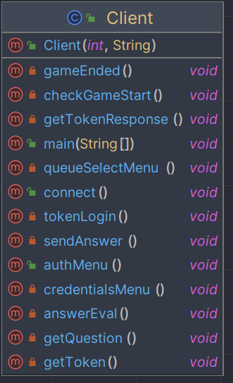
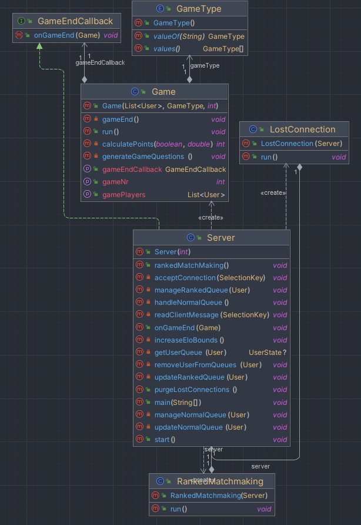
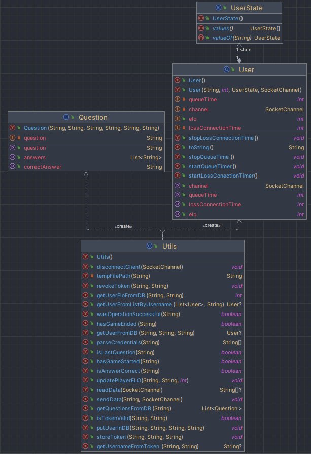

# CPD Project 2

CPD Project 2 of group T04G13.

## Installation and compilation instructions

Since this project was developed in java, we strongly recommend for anyone trying to compile this project to do so using JetBrain's IntelliJ IDE.
The reason for this is because the IDE is very well put together and will take care of the installation of any dependencies needed for the execution, as well as bundle all the classes.

It's mandatory that you run any file from the assign2 directory.

To run multiple clients in IntelliJ we recommend you allow multiple instances, like so:

As for CLI arguments for the Server.java program, you can specify the port, as it's optional and for the Client you have to specify the hostname and port of the server. To specify CLI arguments, edit the configuration for the file in IntelliK.

## Checklist

- [x] Normal matchmaking (Single mode): Players are put into a game in order of queue insertion
- [x] Ranked (Rank mode) matchmaking with elo relaxation over time: Players with similar elos are matched. As time goes on, bigger elo ranges are allowed per game.
- [x] Fault tolerance with queue position resuming: When a client logs in, they are issued a token in case of connection loss. If a client disconnects while in a queue for a match they can rejoin in the same position.
- [x] No race conditions: Writing and, some times, reading of files or critical data structures are locked to avoid race conditions
- [x] Minimize thread overheads: By using fixed thread pools we are capable of minimizing thread overhead, since thread creation is done at the start and any tasks that need a thread that is not available just wait until one is, instead of creating another.
- [x] Avoid slow clients: With the usage of nio's multiplexed non-blocking I/O we were able to stop slow clients from ever halting the system.

## Additional info
This section was written after the deadline, so it's up to the teacher to decide whether or not they want to take this into consideration.
The official submission can be found [here](https://git.fe.up.pt/cpd/2223/t04/g13/-/tags/assignment2)

### Game
The game itself is very similar to the well known "kahoot". On this verison, the player is matched with other players and they're tasked with answering a question the fastest possible to get more points. Said points are converted to elo at the end of a ranked match.

### Project architecture

All the I/O exclusive to the game is done through the usage of multiplexed non-blocking I/O from the nio package.
To handle the game execution, we have a thread pool and, to simplify, each game also has a thread pool for it's players.
There's also two single threads executing background tasks every seconds: ranked queue management and connection loss players management.
This means that, in total, we have a maximum of 1 + MAX_GAMES*MAX_PLAYERS + 2 threads open at all times.

### Limitations
Although none were mandatory, we're aware that the developed project has a few limitations:
- There's no input validation on the client or server side. If one were to put a wrong input despite the guidance of what the valid inputs are, everything would crash.
- It's possible that a user logs in with the credentials of another logged in user.
- The elo gained/lost by players in a ranked match should be based on the skill of the opponents, but isn't.
- If the game thread pool is full and a new game is scheduled to start, when there's an available thread, there's no checks to see if all the players are still connected and the game starts nonetheless (not tested).
- When the server stops, sometimes the clients crash and sometimes they continue executing as if nothing happened until there's a communication attempt.
- If a game is queued for execution while the game thread pool is full the game will be queued until a free thread is available, but the players are not warned of this in any way.
- If a player disconnects mid game, the server crashes.

### Class diagrams
The following class diagrams were generated using IntelliJ's built in [Diagrams plugin](https://www.jetbrains.com/help/idea/class-diagram.html) (Ultimate version exclusive).
Sadly, there doesn't appear to be an inter-package class diagram generator showing dependencies between packages.

## Group members and evaluation:

1. Diogo Babo (up202004950@up.pt) - 25%
2. Gustavo Costa (up202004187@up.pt) - 25%
3. João Oliveira (up20204407@up.pt) - 25%
4. José Araújo (up202007921@up.pt) - 25%
