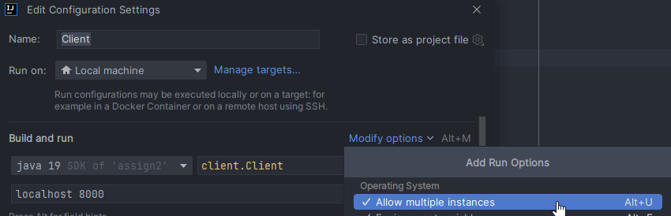

# CPD Project 2

CPD Project 2 of group T04G13.

## Installation and compilation instructions

Since this project was developed in java, we strongly recommend for anyone trying to compile this project to do so using JetBrain's IntelliJ IDE.
The reason for this is because the IDE is very well put together and will take care of the installation of any dependencies needed for the execution, as well as bundle all the classes.

It's mandatory that you run any file from the assign2 directory.

To run multiple clients in IntelliJ we recommend you allow multiple instances, like so:

As for CLI arguments for the Server.java program, you can specify the port, as it's optional and for the Client you have to specify the hostname and port of the server. To specify CLI arguments, edit the configuration for the file in IntelliK.

## Checklist

- [x] Normal matchmaking (Single mode): Players are put into a game in order of queue insertion
- [x] Ranked (Rank mode) matchmaking with elo relaxation over time: Players with similar elos are matched. As time goes on, bigger elo ranges are allowed per game.
- [x] Fault tolerance with queue position resuming: When a client logs in, they are issued a token in case of connection loss. If a client disconnects while in a queue for a match they can rejoin in the same position.
- [x] No race conditions: Writing and, some times, reading of files or insertion

## Group members and evaluation:

1. Diogo Babo (up202004950@up.pt) - 25%
2. Gustavo Costa (up202004187@up.pt) - 25%
3. João Oliveira (up20204407@up.pt) - 25%
4. José Araújo (up202007921@up.pt) - 25%
